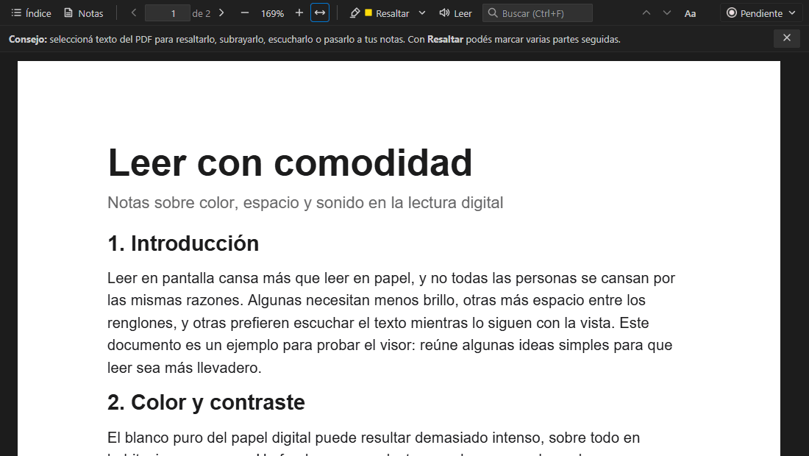
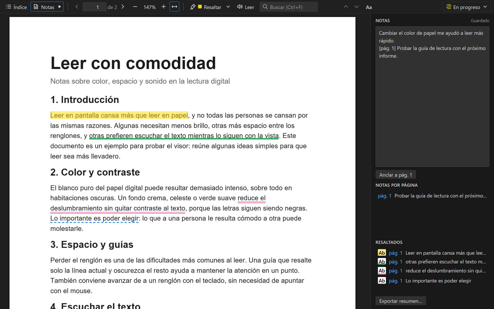
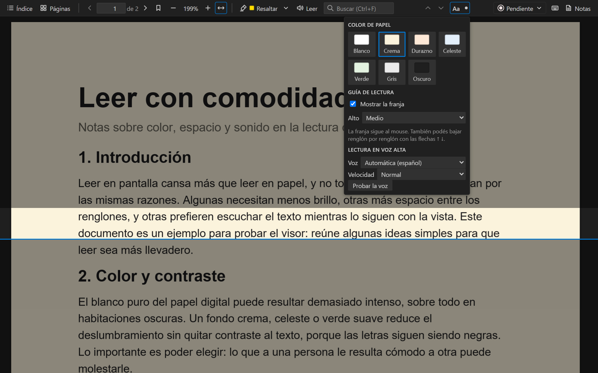
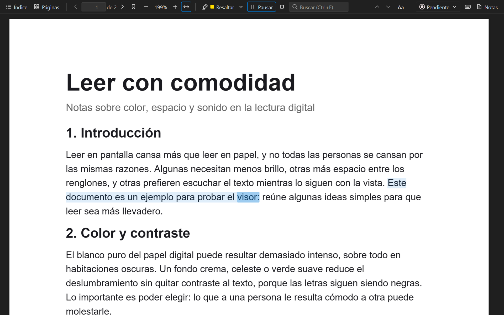

# Visor PDF

[](https://marketplace.visualstudio.com/items?itemName=JulietaMontenegro.visor-de-practicos)
[](https://marketplace.visualstudio.com/items?itemName=JulietaMontenegro.visor-de-practicos)

Un visor de PDF completo dentro de VS Code. Abrí cualquier PDF (apuntes, papers,
manuales, libros, informes, documentación) y leelo, buscá, resaltá, escuchalo en
voz alta y tomá notas al lado, sin salir del editor.

Está pensado para que leer sea cómodo para todas las personas, con opciones como
color de papel, guía de lectura y lectura en voz alta.

> **English:** a full PDF viewer inside VS Code. Read, search, highlight in four
> styles, comment on your highlights, bookmark pages, listen aloud, use a reading
> guide or dark paper, and take notes anchored to pages. Export a summary or a
> copy of the PDF with your highlights. The interface follows VS Code's
> language: Spanish or English. Press `?` in the viewer to see every shortcut.



## Capturas







## Qué hace

### Leer y moverse por el documento

- **Se abre solo**: al hacer doble click en un `.pdf`, se abre con este visor.
  Recuerda el zoom y la última página que viste de cada archivo.
- **Índice y links**: si el PDF tiene marcadores, el botón *Índice* los muestra
  a la izquierda para saltar entre secciones. Los links del PDF se pueden
  clickear (los externos se abren en el navegador, con la confirmación de VS
  Code). Después de un salto aparece *← Volver* (también `Alt+←`).
- **Miniaturas**: el botón *Páginas* muestra una imagen chiquita de cada página
  para saltar rápido, sobre todo en PDFs sin índice.
- **Páginas marcadas**: el señalador de la barra (o la tecla `M`) marca la página
  que estás viendo, como un señalador de papel. Las páginas marcadas aparecen
  en el panel de notas para volver con un click.
- **Seleccionar y copiar texto**, como en cualquier lector.
- **Buscar** con `Ctrl+F` (o el campo de la barra): no distingue mayúsculas ni
  tildes, así que "pagina" encuentra "Página". `Enter` va a la siguiente
  coincidencia, `Shift+Enter` a la anterior y `Esc` borra la búsqueda.
  Los PDFs escaneados son imágenes, así que no tienen texto para buscar ni copiar.
- **Atajos**: apretá `?` (o el botón del teclado en la barra) para verlos todos.
  Los principales: `RePág` / `AvPág` cambian de página, `+` / `−` el zoom,
  `M` marca la página, `Ctrl+F` busca, `Alt+←` vuelve después de seguir un link
  y `Ctrl+Z` deshace.
  Con texto seleccionado: `1`–`4` resaltan, `R` resalta con el color elegido,
  `C` lo comenta, `N` lo pasa a las notas, `L` lo lee y `Supr` quita el
  resaltado (cada botón del menú muestra su tecla).

### Resaltar y tomar notas

- **Resaltador**: seleccioná texto y elegí un color en el menú que aparece (o
  apretá `1`–`4`). Cada color tiene además su propia forma, para distinguirlos
  sin depender del color: amarillo es fondo, verde subrayado, rosa doble
  subrayado y celeste subrayado punteado. *A notas* copia el texto a tus notas,
  anclado a su página. Todos quedan listados en el panel de notas.
  - *Comentarios*: con un click sobre un resaltado (o con texto seleccionado),
    **Comentar** (`C`) abre un cuadro para escribir qué significa para vos
    ("esto entra en el parcial"). `Enter` guarda y `Esc` cancela. Los
    resaltados con comentario llevan un puntito naranja y lo muestran al pasar
    el mouse; también aparece en la lista del panel de notas y en el resumen
    exportado.
  - *Quitar resaltados*: con un click sobre un resaltado le cambiás el color o
    lo quitás entero con **Quitar resaltado** (o `Supr`). Si seleccionás solo
    una parte de algo resaltado, ese botón quita solo esa parte. En la lista del
    panel de notas cada resaltado tiene su **×**.
  - *Modo resaltador*: el botón **Resaltar** de la barra funciona como un
    marcador. Si no hay nada seleccionado, lo activa, y todo lo que selecciones
    se resalta directo con el color elegido (la flecha al lado cambia el color).
    En esa misma flecha está el **Borrador** (`5`): lo que selecciones con él
    deja de estar resaltado. `Esc` sale del modo.
- **Deshacer**: `Ctrl+Z` deshace lo último que hiciste (un resaltado, una goma,
  lo que escribiste en las notas, una nota borrada o un cambio de estado) y
  `Ctrl+Y` lo vuelve a hacer.
- **Notas**: el botón *Notas* abre un panel al costado. Se guardan solas
  mientras escribís.
- **Notas ancladas a una página**: cualquier línea que tenga `[pág. 5]` queda
  anclada a esa página. El botón *Anclar a pág. X* agrega la etiqueta con la
  página que estás viendo, y en *Notas por página* hacés click para saltar ahí
  o la borrás con su **×**.
- **Exportar resumen**: al final del panel de notas, guarda un archivo Markdown
  con tus notas, resaltados, comentarios y páginas marcadas, ordenados por
  página, para repasar o compartir.
- **PDF con resaltados**: guarda una copia del PDF con tus resaltados como
  anotaciones de verdad, así se ven en cualquier lector (Acrobat, Edge, Chrome,
  Firefox) y los comentarios aparecen como notas del PDF. El original no se toca.

### Leer con comodidad

- **Leer en voz alta**: el botón **Leer** lee desde la página que estás viendo
  hasta el final, marcando la frase y la palabra que va leyendo y moviendo la
  página para que no la pierdas. Si hay texto seleccionado, lee solo eso. Se
  puede pausar y detener. La voz y la velocidad se eligen en el menú **Aa**.
  Usa las voces instaladas en tu sistema: en Windows se agregan en
  *Configuración → Hora e idioma → Voz*.
- **Opciones de lectura** (botón **Aa**), útiles por ejemplo con dislexia, TDAH,
  baja visión o cansancio visual. Valen para todos tus PDFs:
  - *Color de papel*: crema, durazno, celeste, verde o gris en lugar de blanco.
    El texto conserva todo su contraste. Y *Oscuro*, para leer de noche: la
    página se ve gris oscura con el texto claro.
  - *Guía de lectura*: una franja que sigue al mouse y oscurece el resto de la
    página para no perder el renglón. Con las flechas `↑` `↓` avanza renglón por
    renglón.

### Organizar tus PDFs

- **Estado de cada PDF**: *Pendiente / En progreso / Hecho*, en el botón de la
  derecha de la barra, para llevar la cuenta de lo que ya leíste, revisaste o
  terminaste. En el explorador de VS Code y en la pestaña del PDF aparece una
  marca al lado del nombre: ✓ verde si está hecho y ◐ amarilla si está en progreso.
- **Vista lateral**: el ícono de la barra de la izquierda muestra todos los PDFs
  de la carpeta abierta, agrupados por carpeta, con el estado de cada uno, hasta
  qué página llegaste leyendo (por ejemplo, *pág. 12/40*) y cuántos llevás
  terminados.
- **Idioma**: el visor se ve en español o en inglés, según el idioma de VS Code.
- **Novedades**: después de cada actualización, un cartel cuenta qué hay de
  nuevo. La lista completa se abre con el comando *Visor PDF: Ver novedades*.

## Instalación

En VS Code, abrí la vista de extensiones (`Ctrl+Shift+X`), buscá
**Visor PDF** e instalala.

### Desde un archivo .vsix

1. Descargá el archivo `visor-de-practicos-<versión>.vsix`.
2. En VS Code, abrí la vista de extensiones (`Ctrl+Shift+X`).
3. En el menú `…` de arriba, elegí **Install from VSIX…** y seleccioná el archivo.

También desde una terminal:

```
code --install-extension visor-de-practicos-0.6.1.vsix
```

## Dónde se guardan tus datos

El estado, las notas y los resaltados se guardan en un archivo `.practicos.json`
dentro de la misma carpeta que el PDF. Así viajan con tus archivos (Drive, un
pendrive, git…) y nada sale de tu computadora. La extensión oculta ese archivo
en el explorador de VS Code; si querés verlo, en la configuración buscá
*Files: Exclude* y sacá `**/.practicos.json`.

```json
{
  "version": 1,
  "practicos": {
    "informe.pdf": {
      "estado": "en-progreso",
      "notas": "[pág. 3] revisar las conclusiones",
      "resaltados": [
        { "id": "r-…", "pagina": 3, "inicio": 47, "fin": 67, "color": "amarillo", "texto": "resultados principales", "comentario": "entra en el parcial", "creado": "…" }
      ],
      "marcadores": [3, 8],
      "progreso": { "paginaMaxima": 5, "totalPaginas": 12 },
      "actualizado": "2026-09-28T15:24:06.811Z"
    }
  }
}
```

Si ese archivo se rompe (por ejemplo, al editarlo a mano), la extensión avisa y
no lo modifica hasta que lo corrijas, para no perder datos.

Los resaltados no modifican el PDF. Si el PDF cambia y un texto resaltado ya no
aparece en su página, figura atenuado en la lista para que sepas que se perdió.

Las opciones de lectura (color de papel, guía y voz) se guardan en VS Code, no
en `.practicos.json`, porque son tuyas y no de un documento.

## Si preferís otro visor para algún PDF

Click derecho en la pestaña del PDF → **Reopen Editor With…** y elegí otro
editor. Ahí mismo podés cambiar cuál se usa por defecto.

## Para desarrollar

Hace falta [Node.js](https://nodejs.org) 22 o más nuevo.

```
npm install        # instala pdf.js y la herramienta para empaquetar
npm test           # corre las pruebas automáticas (no abre VS Code)
npm run e2e        # prueba el visor en Chrome o Edge con mouse y teclado reales
npm run banco      # abre el visor en el navegador: http://localhost:5757
npm run empaquetar # genera el .vsix para compartir
npm run capturas   # regenera las imágenes de docs/imagenes (capturas, GIF y portada)
```

Para probar dentro de VS Code, abrí esta carpeta y apretá `F5`.

- `extension.js`: registra el visor y maneja lo que pide (leer el PDF, guardar datos).
- `src/`: código de la extensión (Node). `almacen.js` es el único que lee y
  escribe `.practicos.json`, y `plantilla.js` arma el HTML del visor.
- `l10n/en.json`: los textos en inglés. En el código los textos van en español
  dentro de `t('…')`, y `npm test` avisa si alguno no tiene traducción.
- `media/`: el visor que corre dentro de VS Code (HTML/CSS/JS del navegador).
- `test/`: pruebas automáticas, el `vscode` simulado y el banco de pruebas.

## Licencia

MIT. Incluye [PDF.js](https://github.com/mozilla/pdf.js) (Apache 2.0) y
[pdf-lib](https://github.com/Hopding/pdf-lib) (MIT).
